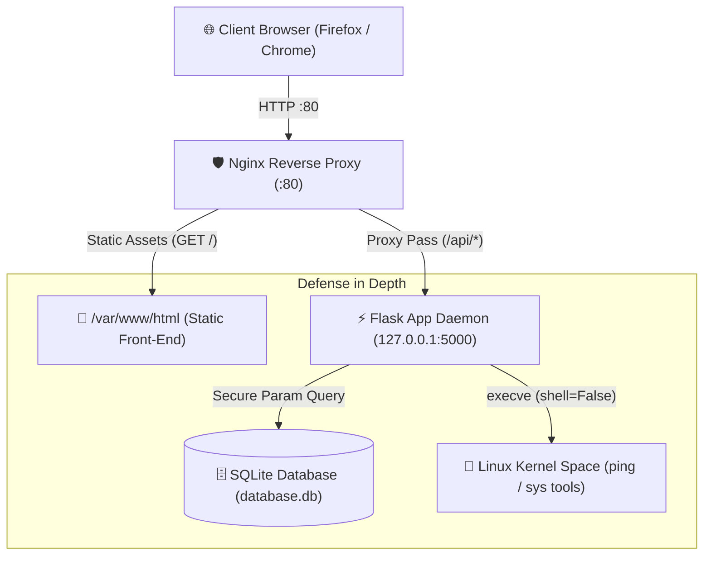

# 🛡️ AppSec Lab | Vulnerable & Hardened Web Infrastructure

<p align="left">
  
  
  
  
  
  
</p>

A full-stack, bare-metal-equivalent web application security research lab engineered on a virtualized **Ubuntu Linux** environment. This project demonstrates the lifecycle of modern web infrastructure: reverse proxy routing, asynchronous API bridging, and realistic **OWASP Top 10** vulnerability exploitation followed by defense-in-depth code remediation and kernel-level process isolation.

> [!NOTE]
> This laboratory is built for academic research and vulnerability demonstration. Ensure all testing is conducted inside isolated sandbox network adapters (Host-Only / NAT) to avoid accidental network exposure.

---

## 🚀 Key Architectural Highlights

This environment demonstrates end-to-end security engineering across all layers of the web stack:

1. **Reverse Proxy Edge Routing:** Employs **Nginx** on port `80` to completely decouple public web traffic from application runtimes. Static frontend artifacts (`HTML/CSS/JS`) are served directly, while API routes are dynamically proxied to internal Unix localhost sockets.
2. **Prepared Statement SQL Compiling:** Eliminates classic **SQL Injection (SQLi)** by replacing arbitrary dynamic query string formatting with pre-compiled parameterized statement tuples (`?` placeholders) executed via native `sqlite3` drivers.
3. **DOM-Context Text Sanitization:** Replaces insecure `innerHTML` node parsing with strict `.textContent` evaluation, completely mitigating **Stored Cross-Site Scripting (XSS)** vectors at the browser rendering boundary.
4. **Subprocess Shell Decoupling:** Replaces risky `/bin/sh` process dispatching (`shell=True`) with direct, non-interpolated execution arrays (`shell=False`), combined with regex-based strict input whitelisting to eliminate **Remote Command Execution (RCE)**.
5. **Systemd Service Isolation:** Deploys the application as an automated background daemon (`webapp.service`) with `Restart=always` resilience, `ProtectSystem` sandboxing, and strict userland dependency isolation via `python3-venv`.
---

## 🏗️ System & Network Architecture



---

## 🔬 Vulnerability Case Studies & Hardening

### 1. SQL Injection (SQLi)

* **Vulnerable Endpoint:** `GET /api/search?q=`
* **Flaw Mechanism:** Dynamic string interpolation using Python f-strings injected raw client-supplied parameters directly into the `WHERE` clause:
```sql
SELECT * FROM posts WHERE content LIKE '%{query}%'

```

* **Exploitation:** Supplying an unescaped single quote broken out of SQL string literals. Injecting the boolean tautology `' OR 1=1 --` bypassed authentication and leaked all database records.
* **Remediation:** Enforced driver-level parameterized tuples:
```python
cursor.execute("SELECT * FROM posts WHERE content LIKE ?", (f"%{query}%",))

```

### 2. Stored Cross-Site Scripting (Stored XSS)

* **Vulnerable Component:** Client DOM rendering inside `app.js`.
* **Flaw Mechanism:** Injecting unescaped database payloads into container cards using `innerHTML`.
* **Exploitation:** Persistent execution of arbitrary JavaScript across all connected sessions via:
```html


```

* **Remediation:** Swapped dynamic HTML parsing with `.textContent` assignment, converting executable tags into harmless string primitives.

### 3. Remote Command Injection (RCE)

* **Vulnerable Endpoint:** `POST /api/ping`
* **Flaw Mechanism:** Invoking the system command shell via `subprocess.check_output(cmd, shell=True)` with concatenated user input.
* **Exploitation:** Command concatenation using shell separators allowed full local privilege enumeration:
```text
127.0.0.1; cat /etc/passwd

```

* **Remediation:** Stripped the subshell layer via `shell=False` with argument vectors, backed by strict regex whitelisting:
```python
if not re.match(r'^[a-zA-Z0-9.-]+$', host):
    return jsonify({"error": "Invalid target format"}), 400
subprocess.check_output(["ping", "-c", "1", host], shell=False)

```
---

## 🛠️ Local Development & Lab Setup

Follow these steps to run the environment locally on an Ubuntu VM or Linux installation:
1. **Clone the repository:**
```bash
git clone [https://github.com/ryj0-1/web-abb-security-lab.git] 
(https://github.com/ryj0-1/web-abb-security-lab.git)
cd secure-webapp-lab

```
2. **Configure Python environment:**
```bash
python3 -m venv venv
source venv/bin/activate
pip install -r requirements.txt
```
3. **Initialize the SQLite database:**
```bash
python backend/init_db.py
```
4. **Start the backend server:**
```bash
python backend/app.py

```

> [!IMPORTANT]
> In a production setup, ensure Nginx is configured to forward `/api/` traffic to `http://127.0.0.1:5000/api/` as detailed in `nginx/default.conf`. Run the Flask process behind a production WSGI server (e.g., Gunicorn) when deploying outside sandbox labs.

---

## 📜 License

This project is licensed under the **[MIT License] (https://github.com/ryj0-1/web-app-security-lab/blob/main/LICENSE)** Created for security research, portfolio presentation, and vulnerability reproduction labs.
